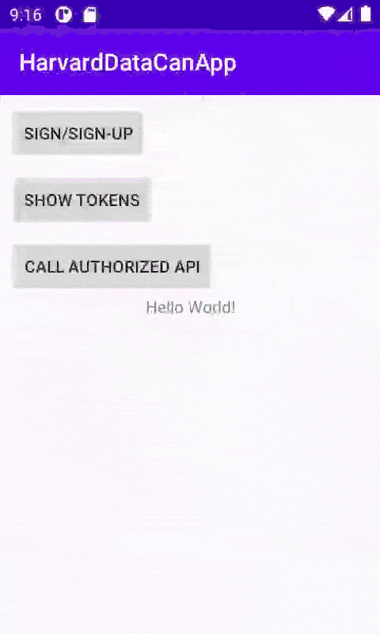

# Integrating MyDataCan to an Android app



This guide is for Android developers who want to integrate [MyDataCan](https://harvard.mydatacan.org) to their app and have users log in using their [HarvardKey](https://key.harvard.edu) credentials.

MyDataCan uses [Amazon Cognito](https://aws.amazon.com/cognito/) for authentication and this guide shows how to use the [AWS Amplify](https://aws.amazon.com/amplify/) libraries for Android to handle web sign-in with Cognito.

## Integration Steps

The steps for integration can be divided into three main steps:

1. Install AWS Amplify libraries with Gradle.
2. Configure `amplifyconfiguration.json` and `AndroidManifest.xml`
3. Call the necessary methods for web sign-in and fetching session data.

### Install AWS Amplify libraries with Gradle

The following dependencies must be added to the app's `build.gradle`:

```gradle
dependencies {
  implementation 'com.amplifyframework:core:1.1.2'
  implementation 'com.amplifyframework:aws-auth-cognito:1.1.2'
}
```

For a full `build.gradle` example, have a look at the script from [the demo app](src/app/build.gradle).

### Configure `amplifyconfiguration.json`

In the `main/res/raw` directory of your app's `src` directory, create a new JSON file named `amplifyconfiguration.json`. The contents of this file must be something like the following

```json
{
  "auth": {
    "plugins": {
      "awsCognitoAuthPlugin": {
          "IdentityManager": {
            "Default": {}
          },
          "CognitoUserPool": {
              "Default": {
                "PoolId": "// PUT COGNITO USER POOL ID HERE //",
                "AppClientId": "// PUT YOUR APP CLIENT ID HERE  //",
                "AppClientSecret": "// PUT YOUR APP CLIENT SECRET HERE //",
                "Region": "// PUT YOUR COGNITO USER POOL REGION HERE //"
            }
          },
          "Auth": {
            "Default": {
              "OAuth": {
                  "WebDomain": "// PUT YOUR COGNITO DOMAIN HERE //",
                  "AppClientId": "// PUT YOUR APP CLIENT ID HERE //",
                  "AppClientSecret": "// PUT YOUR APP CLIENT SECRET HERE //",
                  "SignInRedirectURI": "// PUT YOUR CALLBACK URL HERE //",
                  "SignOutRedirectURI": "// PUT YOUR SIGN OUT URL HERE //",
                  "Scopes": [
                    "// PUT YOUR SCOPES HERE //"
                  ]
                },
              "authenticationFlowType": "USER_SRP_AUTH"
            }
          }
      }
    }
  }
}
```

The dummy values need to be replaced with real values provided by MyDataCan to the app developer.

### Configure `AndroidManifest.xml`

The URL schemes for the sign-in and sign-out URLs must be added to `AndroidManifest.xml`. The following activity needs to be added

```xml
<activity android:name=".MainActivity" android:launchMode="singleInstance">
  <intent-filter>
    <action android:name="android.intent.action.VIEW" />
    <category android:name="android.intent.category.DEFAULT" />
    <category android:name="android.intent.category.BROWSABLE" />
    <data android:scheme="myapp" />
  </intent-filter>
</activity>
```

".MainActivity" must be replaced with the name of your app's main activity class name. The "myapp" value must be consistent with the values for `SignInRedirectURI` and `SignOutRedirectURI` in `amplifyconfiguration.json`. If the values for `SignInRedirectURI` and `SignOutRedirectURI` are "myapp://", then "myapp" (without the "://") is what needs to be on `Info.plist`. Also, these URL schemes must be consistent with the ones defined in the Amazon Cognito settings in the AWS Console (check with the MyDataCan team).

### Call the necessary methods for web sign-in and fetching session data

The first step before calling methods for web sign-in and fetching session data is initializing Amplify on app startup. In the demo app, this is done in the [`MyAmplifyApp`](src/app/src/main/java/com/example/harvarddatacanapp/MyAmplifyApp.java#L10) class like so:

```java
package com.example.harvarddatacanapp;

import android.util.Log;

import com.amplifyframework.AmplifyException;
import com.amplifyframework.api.aws.AWSApiPlugin;
import com.amplifyframework.auth.cognito.AWSCognitoAuthPlugin;
import com.amplifyframework.core.Amplify;

public class MyAmplifyApp extends android.app.Application {
  public void onCreate() {
      super.onCreate();

    try {
      Amplify.addPlugin(new AWSCognitoAuthPlugin());
      Amplify.addPlugin(new AWSApiPlugin());

      Amplify.configure(getApplicationContext());

      Log.i("MyAmplifyApp", "Initialized Amplify");
    } catch (AmplifyException error) {
      Log.e("MyAmplifyApp", "Could not initialize Amplify", error);
    }
  }
}
```

The [`MainActivity`](src/app/src/main/java/com/example/harvarddatacanapp/MainActivity.java#L16) class makes use of the different methods Amplify provides for signing in and getting the different tokens from the session data upon success. The demo app is meant to be an example of how these methods are used. It is up to the app developer to incorporate them into their own app.

## Resources

* [Getting started](https://docs.amplify.aws/start/q/integration/android). _Amplify Docs_.
* [Authentication - Getting started](https://docs.amplify.aws/lib/auth/getting-started/q/platform/android). _Amplify Docs_.
* [Amplify for Android](https://github.com/aws-amplify/amplify-android). _GitHub_.