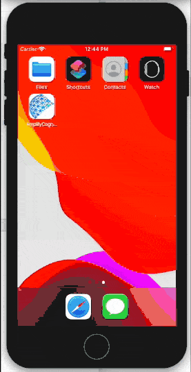

# Incorporating MyDataCan into an iOS app

This guide is for iOS developers who want to incorporate [MyDataCan](https://harvard.mydatacan.org) and have users log in through [HarvardKey](https://key.harvard.edu).

## Resources

* [AWS Amplify Authentication Flow for iOS SwiftUI](https://www.youtube.com/watch?v=wSHnmtnzbfs). _YouTube_.
* [AWS Amplify Auth Web UI for iOS | SwiftUI 2.0, Xcode 12](https://www.youtube.com/watch?v=74fl2EgpXSE). _YouTube_.
* [Getting started](https://docs.amplify.aws/start/q/integration/ios). _Amplify Docs_.
* [Authentication - Getting started](https://docs.amplify.aws/lib/auth/getting-started/q/platform/ios). _Amplify Docs_.
* [Amplify for iOS](https://github.com/aws-amplify/amplify-ios). _GitHub_.
